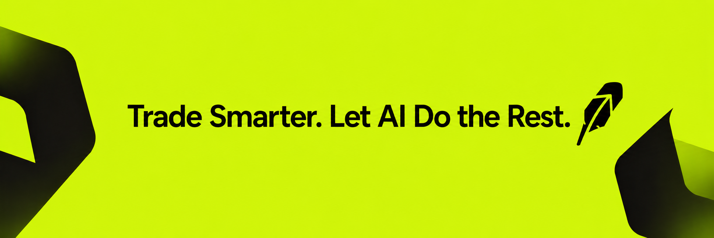

<div align="center">



<br><br>

# Hood Trade

### Pre-trade safety scanner for Robinhood Chain

[](https://github.com/qumiann/hoodtrade/actions)
[](https://hoodtrade.pro)
[](https://python.org)
[](LICENSE)
[](https://docs.robinhood.com/chain/)
[](https://anthropic.com)

<br>

Point it at a swap you're about to sign — get a **GO** / **CAUTION** / **NO-GO** verdict with on-chain evidence.

**Read-only.** Never signs. Never holds funds. Never trades. It inspects — you decide.

<br>

```
╭─ Hood Trade verdict ──────────────────────────────────╮
│  CAUTION   risk score 43                              │
╰───────────────────────────────────────────────────────╯
```

</div>

---

## The Problem

Robinhood Chain launched July 2026 as a permissionless Arbitrum-Orbit L2. Permissionless + brand new = risk:

| Risk | Why it matters |
|:-----|:---------------|
| **Unverified tokens** | Anyone can deploy; the token you're buying may be hours old |
| **Rug pulls** | Uniswap liquidity can be removed — the pool can be drained |
| **Honeypots** | Token lets you buy but blocks sells via a reverting `transfer()` |
| **Stock token debt** | Tokenized equities are debt instruments, not shares — counterparty risk |
| **Residual MEV** | FCFS sequencing blunts sandwiching, but latency races and oracle timing remain |

Hood Trade turns these into a **21-check battery** that runs in seconds before you sign.

---

## How It Works

```
                          ┌─────────────────────────────────────────────┐
                          │            Check Battery (21 checks)        │
                          │                                             │
  ┌──────────┐            │  Contract ── code? owner? supply? honeypot? │
  │   CLI    │  Trade     │  Pool ────── exists? paired? liquid?        │          ┌──────────┐
  │  typer   │──Request──▶│  Execution ─ chain-id? size? MEV context    │──Score──▶│  Engine  │
  │  + rich  │            │  Concentration ─ self-hold? burned?         │          │ decide() │
  └──────────┘            │  Stock ────── disclosure? divergence?       │          └────┬─────┘
                          └─────────────────────────────────────────────┘               │
                                                                                Verdict │
                                                                            (deterministic)
                                                                                       │
                                                                                ┌──────▼──────┐
                                                                                │ AI Summary  │
                                                                                │   Claude    │
                                                                                │ (optional)  │
                                                                                └─────────────┘
```

> **Key design**: the verdict is **deterministic** — any `DANGER` → NO-GO, score thresholds for CAUTION/NO-GO. Claude only *explains* findings; it **never overrides the gate**. No API key? Template fallback. Fully offline.

---

## Check Reference

<table>
<tr><th>ID</th><th>Area</th><th>What it checks</th><th>Severity</th></tr>
<tr><td><code>CONTRACT-EXISTS</code></td><td>Contract</td><td>Token address has deployed bytecode</td><td>OK / DANGER</td></tr>
<tr><td><code>CONTRACT-OWNER</code></td><td>Contract</td><td>Owner / admin key — renounced or active</td><td>OK / WARN</td></tr>
<tr><td><code>CONTRACT-SUPPLY</code></td><td>Contract</td><td>ERC-20 reads: name, symbol, totalSupply</td><td>OK / WARN</td></tr>
<tr><td><code>CONTRACT-HONEYPOT</code></td><td>Honeypot</td><td>Simulated <code>transfer()</code> to dead address</td><td>OK / DANGER</td></tr>
<tr><td><code>CONTRACT-APPROVE</code></td><td>Honeypot</td><td>Simulated <code>approve()</code> call</td><td>OK / WARN</td></tr>
<tr><td><code>CONC-SELF</code></td><td>Concentration</td><td>Token contract self-holds supply share</td><td>OK / WARN / DANGER</td></tr>
<tr><td><code>CONC-BURNED</code></td><td>Concentration</td><td>Burned supply ratio — thin float risk</td><td>OK / WARN</td></tr>
<tr><td><code>POOL-EXISTS</code></td><td>Pool</td><td>Pool address has deployed code</td><td>OK / INFO / DANGER</td></tr>
<tr><td><code>POOL-PAIR</code></td><td>Pool</td><td>Pool pairs expected token0 / token1</td><td>OK / DANGER</td></tr>
<tr><td><code>POOL-LIQUIDITY</code></td><td>Pool</td><td>Active in-range liquidity (Uniswap V3)</td><td>OK / DANGER</td></tr>
<tr><td><code>EXEC-CHAINID</code></td><td>Execution</td><td>RPC chain-id matches configured value</td><td>OK / DANGER</td></tr>
<tr><td><code>EXEC-SIZE</code></td><td>Execution</td><td>Trade size band vs. pool depth</td><td>OK / INFO / WARN</td></tr>
<tr><td><code>EXEC-MEV</code></td><td>Execution</td><td>FCFS sequencing context + residual MEV</td><td>INFO</td></tr>
<tr><td><code>STOCK-DISCLOSURE</code></td><td>Stock Token</td><td>Debt-instrument disclosure for tickers</td><td>WARN</td></tr>
<tr><td><code>STOCK-DIVERGENCE</code></td><td>Stock Token</td><td>Off-hours / underlying price divergence</td><td>OK — DANGER</td></tr>
<tr><td><code>REP-HONEYPOT</code></td><td>Reputation</td><td>GoPlus honeypot flag + buy/sell tax</td><td>OK / WARN / DANGER</td></tr>
<tr><td><code>REP-PERMISSIONS</code></td><td>Reputation</td><td>Mintable, pausable, blacklist, hidden owner</td><td>OK / WARN / DANGER</td></tr>
<tr><td><code>REP-SOURCE</code></td><td>Reputation</td><td>Verified source code + holder count</td><td>OK / INFO / WARN</td></tr>
<tr><td><code>MKT-LIQUIDITY</code></td><td>Market</td><td>Absolute quote-side liquidity (DexScreener)</td><td>OK / WARN / DANGER</td></tr>
<tr><td><code>MKT-DEPTH</code></td><td>Market</td><td>Trade size vs available liquidity</td><td>OK / INFO / WARN</td></tr>
<tr><td><code>MKT-ACTIVITY</code></td><td>Market</td><td>24h volume + buy/sell transaction balance</td><td>OK / INFO / WARN</td></tr>
</table>

---

## Quick Start

```bash
git clone https://github.com/qumiann/hoodtrade
cd hoodtrade
python -m venv .venv && source .venv/bin/activate
pip install -e '.[ai,dev]'       # drop [ai] to skip Claude summaries
cp .env.example .env             # set HOODTRADE_RPC_URL
```

> **Dependencies**: `httpx` `pydantic` `typer` `rich` — no web3. Optional: `anthropic`.

---

## Usage

```bash
# Verify RPC connectivity
hoodtrade doctor

# Scan a buy
hoodtrade scan \
  --token 0xTokenAddr \
  --quote 0xUSDGAddr  \
  --amount 2500       \
  --pool  0xPoolAddr  \
  --direction buy

# JSON for scripting (exit: 0=GO, 1=CAUTION, 2=NO-GO)
hoodtrade scan --token 0x.. --quote 0x.. --amount 500 --json --no-ai
```

<details>
<summary><strong>Example output</strong></summary>

```
╭─ Hood Trade verdict ─────────────────────────────────╮
│  CAUTION   risk score 43                             │
╰──────────────────────────────────────────────────────╯
Proceed carefully — the scanner found notable risks.

Key risks
  • Token has an active owner: An owner address can pause transfers…
  • Trade size: large (>= $100k): split or route via an aggregator…
  • AAPL may be a tokenized equity (debt instrument)

Verify yourself
  → Confirm the token and pool addresses against the official source.
  → Check the pool's real depth for your size on the DEX UI.
  → Set a tight slippage limit; split large orders.

┌─ Findings ───────────────────────────────────────────┐
│ check              │ sev    │ finding                 │
│ EXEC-CHAINID       │ ok     │ Chain id verified       │
│ CONTRACT-EXISTS    │ ok     │ Contract code present   │
│ CONTRACT-OWNER     │ warn   │ Active owner detected   │
│ CONTRACT-HONEYPOT  │ ok     │ Transfer sim passed     │
│ CONC-SELF          │ ok     │ Self-holding negligible │
│ POOL-LIQUIDITY     │ ok     │ Active liquidity OK     │
│ EXEC-SIZE          │ warn   │ Trade size: large       │
│ STOCK-DISCLOSURE   │ warn   │ Tokenized equity (debt) │
│ EXEC-MEV           │ info   │ FCFS — reduced MEV      │
└──────────────────────────────────────────────────────┘
```

</details>

<details>
<summary><strong>Honeypot detection (NO-GO)</strong></summary>

```
╭─ Hood Trade verdict ─────────────────────────────────╮
│  NO-GO   risk score 190                              │
╰──────────────────────────────────────────────────────╯
High-risk trade — the scanner flagged blocking issues.

Key risks
  • Honeypot risk — transfer() reverts
  • Token self-holds 65% of supply
```

</details>

---

## Configuration

All settings via env vars (prefix `HOODTRADE_`) or `.env` — see [`.env.example`](.env.example).

| Variable | Default | Description |
|:---------|:--------|:------------|
| `HOODTRADE_RPC_URL` | *(required)* | JSON-RPC endpoint for Robinhood Chain |
| `HOODTRADE_CHAIN_ID` | *(unset)* | Pin expected chain id for RPC verification |
| `HOODTRADE_CAUTION_SCORE` | `25` | Score threshold for CAUTION |
| `HOODTRADE_NOGO_SCORE` | `60` | Score threshold for NO-GO |
| `HOODTRADE_LIQ_DANGER_BELOW` | `5000` | Liquidity (USD) below which a book is "very thin" |
| `HOODTRADE_LIQ_WARN_BELOW` | `25000` | Liquidity (USD) below which a book is "low" |
| `HOODTRADE_BLOCK_ON_THIN_LIQUIDITY` | `true` | Thin liquidity is NO-GO (`false` → CAUTION) |
| `HOODTRADE_BLOCK_ON_HIGH_IMPACT` | `true` | Oversized trade is NO-GO (`false` → CAUTION) |
| `HOODTRADE_AI_ENABLED` | `true` | Enable Claude risk summaries |
| `HOODTRADE_AI_MODEL` | `claude-opus-4-8` | Model for AI summaries |
| `ANTHROPIC_API_KEY` | *(unset)* | Required only when AI is enabled |

### New-chain leniency

A freshly-launched chain legitimately has thin books and little trading history,
so flagging every low-liquidity token as NO-GO is noise. For young chains
(Robinhood Chain by default) the scanner **relaxes only the market-maturity
signals** — thin liquidity, low volume and trade-size impact become CAUTION
instead of a hard block. **Security signals are never relaxed:** a honeypot,
hidden transfer fee, mint capability or owner permission still forces NO-GO on
any chain.

- `hoodtrade scan 0x… --strict` — full strictness even on a new chain
- `hoodtrade scan 0x… --lenient` — apply new-chain leniency on any chain

---

## Development

```bash
ruff check src tests            # lint
ruff format --check src tests   # format check
pytest -q                       # 156 tests
```

See [CONTRIBUTING.md](CONTRIBUTING.md) for the check protocol, severity guide, and PR conventions.

---

## Roadmap

- [ ] Tick-by-tick depth simulation (Uniswap V3 tick math)
- [ ] Live USD/equity price oracles for divergence measurement
- [ ] Holder-concentration via indexer (Blockscout / Dune)
- [ ] Bytecode pattern analysis (proxy detection, exploit signatures)
- [ ] Multi-venue routing comparison (Uniswap vs Pleiades vs 0x)
- [ ] Telegram / Discord bot interface
- [ ] Watch mode — continuous token monitoring

---

## Project Structure

```
hoodtrade/
├── src/hoodtrade/
│   ├── checks/
│   │   ├── contract.py        # code, owner, supply
│   │   ├── honeypot.py        # transfer/approve simulation
│   │   ├── concentration.py   # self-holding, burned supply
│   │   ├── pool.py            # exists, liquidity, pair integrity
│   │   ├── execution.py       # chain-id, size, MEV context
│   │   ├── stock_token.py     # disclosure, divergence
│   │   ├── reputation.py      # GoPlus-backed checks
│   │   └── market.py          # DexScreener-backed checks
│   ├── engine.py              # verdict decision (deterministic)
│   ├── ai.py                  # Claude summary layer
│   ├── rpc.py                 # minimal JSON-RPC client
│   ├── sources/
│   │   ├── goplus.py          # GoPlus Security API client
│   │   └── dexscreener.py     # DexScreener market data client
│   ├── cli.py                 # typer CLI
│   ├── config.py              # pydantic-settings
│   └── models.py              # core types
├── tests/                     # 152 tests
├── docs/architecture.md
├── examples/sample_output.md
└── .github/workflows/ci.yml   # ruff + pytest on 3.10-3.12
```

---

<div align="center">

**Hood Trade** is not financial advice. A green verdict means "no automated red flags" — not "safe."

Always verify addresses against official sources before signing.

MIT License

</div>
